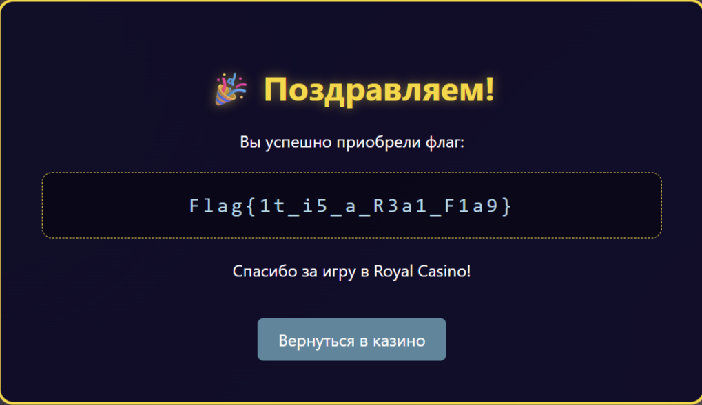

Анализируем наш сервис и видим, что есть пользователь Christmas_Father, которые имеет права админа,
и пароль для каждого пользователя генерируется в зависимости от введенного пользователем имени.
Анализируя, как генерируется пароль, видно, что введенное имя проходит 3 стадии шифрования

Первая - это кастомная, вручную реализованная версия шифрования AES-128 в режиме ECB. Вторая - это самописное блочное шифрование. Третье - хэширование с солью, которая находится на сервере. Во второй стадии есть сжимание данных, которая образует неоднозначность

Также заметим, что в первом шифровании есть проверка на кол-во символов и дополнение строки рандомными символами в её начало

То есть, мы можем написать любое имя вида Christmas_FatherXXXXXXXX и получим точно такой же пароль, как и у админа. Зарегистрируемся, например, по именем Christmas_Fatheraaaaaaaa

Получаем пароль, теперь зайдем под именем Christmas_Father и полученным паролем. Получаем админку и покупаем флаг

