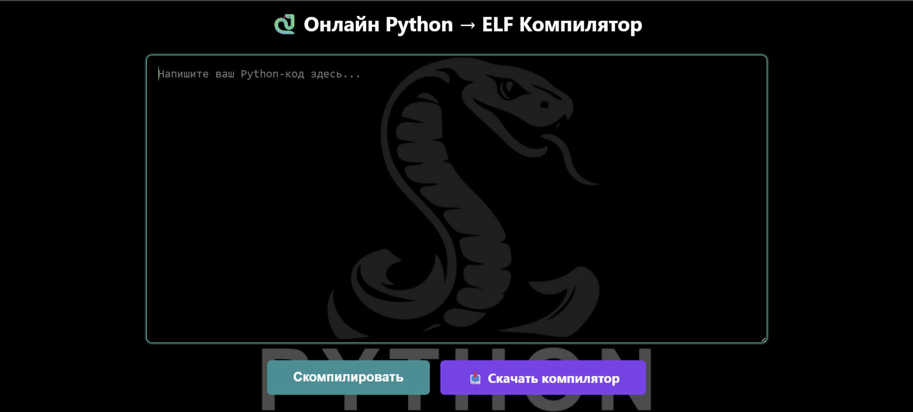
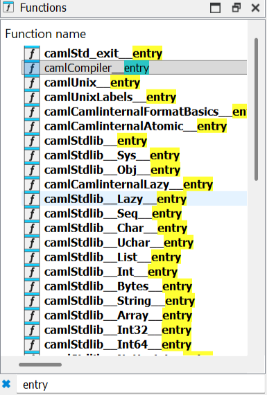
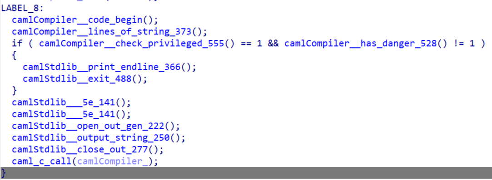
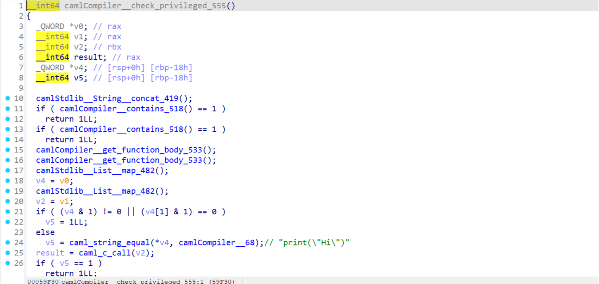
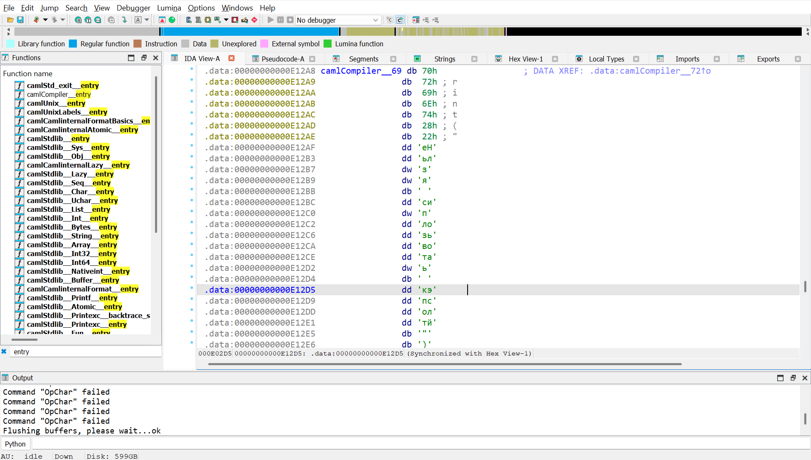
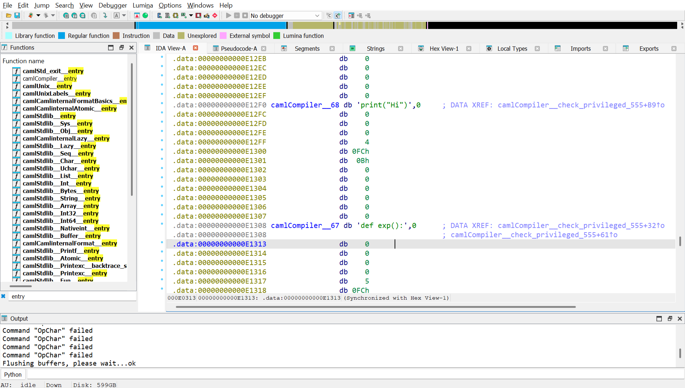
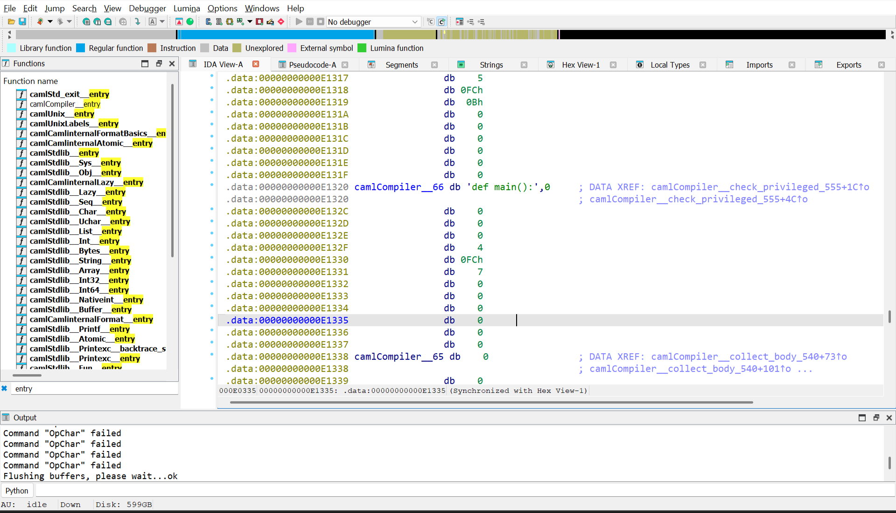
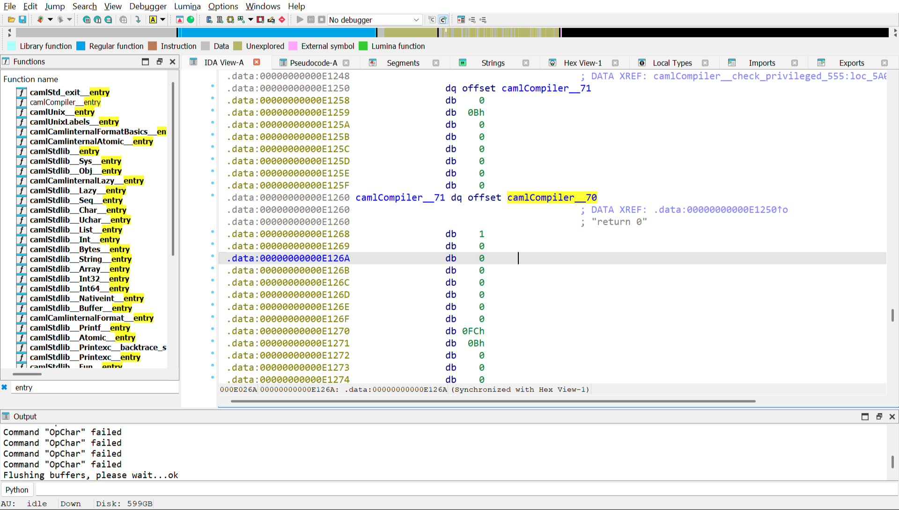
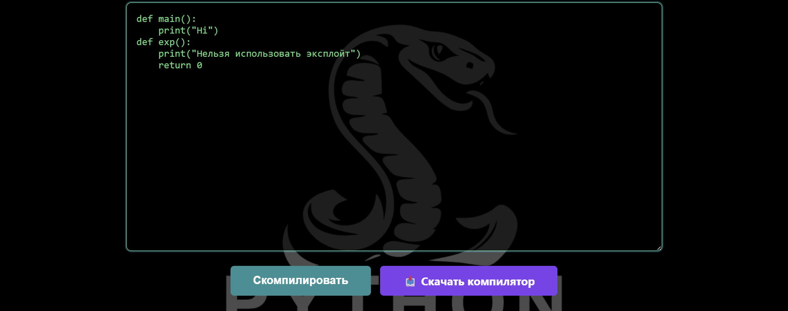
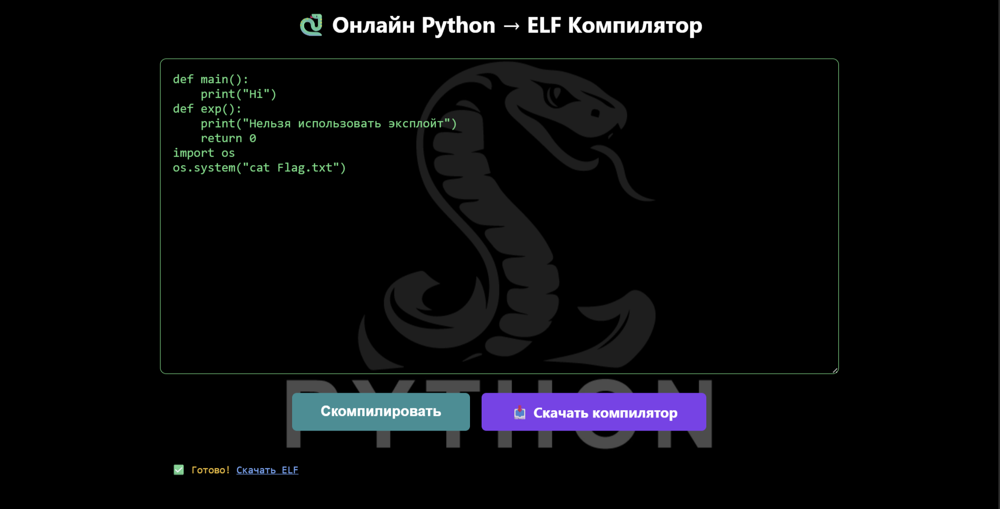

Запускаем сервис, заходим на сайт и видим среду для написания кода на Python, которая компилирует код и конвертирует его в ELF

Понятно, что нам не интересно написание кода, нам нужен флаг, давайте скачаем компилятор и проанализируем его. Скачиваем его и заходим в IDA Pro, находим функцию основной логики

Находим основную функцию проверки условий

Переходим в функцию camlCompiler_check_privileged_555

Анализируем её, смотрим, какие строки используются для проверок

Смотрим, где используется каждая строка через Ctrl+x и восстанавливаем структуру кода, которая нужна для выполнения всех проверок, не забываем про 4 пробела в функциях (отступы в Python)

Теперь пробуем внедрить эксплойт

Отлично, получаем ELF файл, давайте его запустим

Получаем флаг

