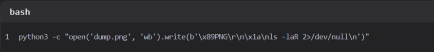
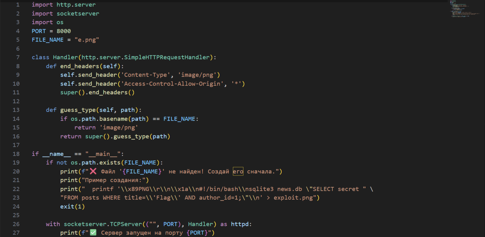
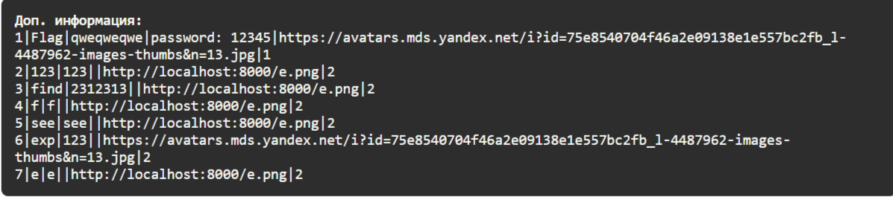

Регистрируем пользователя. Теперь нам нужна URL с эксплойтом, чтобы найти, где находится файлы с данными базы данных, создаем изображение:

Пишем любой сервер, который позволит выгрузить наше изображение для присвоения URL:

Теперь создаем статью и в изображение передаем нашу URL, публикуем и переходим на статью и в секретной информации у нас будет следующее сообщение:

Теперь делаем новый эксплойт, который позволит прочитать данные из файлы news.db:

Создаем новую статью и добавляем новое изображение и получаем наш флаг:

